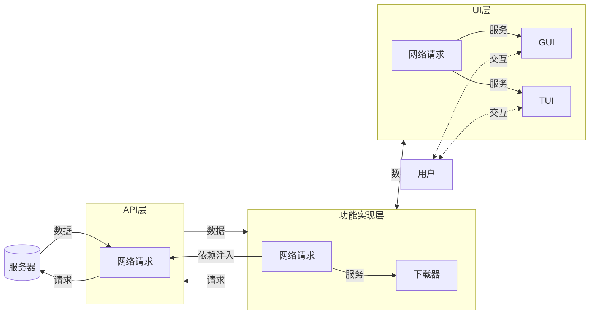

# BiliTools-Remake

## 分层

```mermaid
flowchart LR

server[(服务器)] --数据--> reqapi
reqapi --请求--> server

subgraph api[API层]
    reqapi[网络请求]
end

api --数据--> func
func --请求--> api
subgraph func[功能实现层]
    reqfunc[网络请求] --依赖注入--> reqapi
    reqfunc --服务--> downloader
    downloader[下载器]
end

func <--数据--> ui
subgraph ui[UI层]
    requi[网络请求] --服务--> gui
    gui[GUI]
    requi --服务--> tui
    tui[TUI]
end

user[用户] <-.交互.-> gui
user <-.交互.-> tui

```

