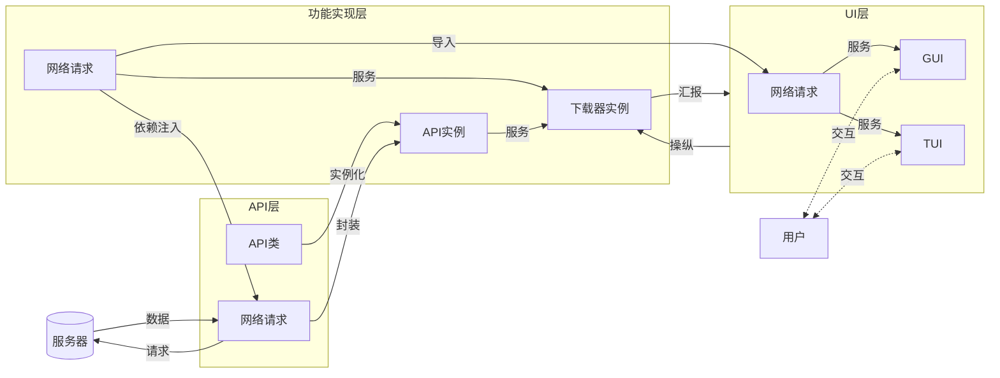

# BiliTools-Remake

## 分层

```mermaid
flowchart LR

server[(服务器)] --数据--> reqapi
reqapi --请求--> server

subgraph api[API层]
    reqapi[网络请求]
    apiclss[API类] 
end

subgraph func[功能实现层]
    reqfunc[网络请求] --依赖注入--> reqapi
    reqfunc --服务--> downloader
    downloader[下载器实例]
    apiclss --实例化--> apiinst[API实例]
    reqapi --封装--> apiinst
    apiinst --服务--> downloader
end

subgraph ui[UI层]
    requi[网络请求] --服务--> gui
    gui[GUI]
    reqfunc --导入--> requi --服务--> tui
    tui[TUI]
end

ui --操纵--> downloader
downloader --汇报--> ui

user[用户] <-.交互.-> gui
user <-.交互.-> tui

```

